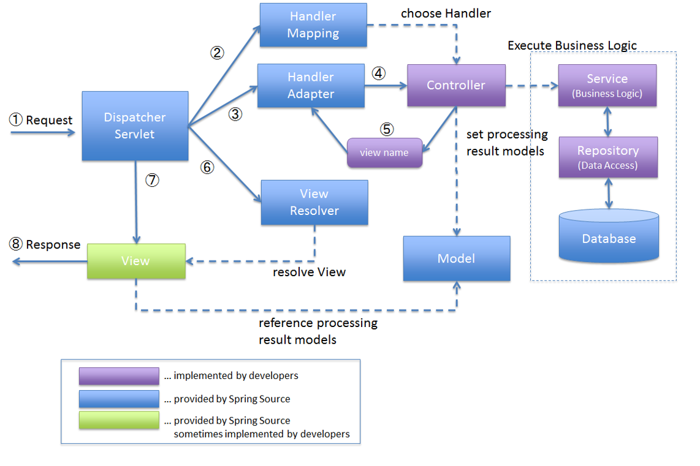

# 1일차 정리

## 1. cmder 다운로드 및 설치
- cmder 사이트 다운로드 진행 : https://cmder.app/
- 압축해제: c:/dev 설치

## 2. Git & GitHub 설치 및 연동
- Git 다운로드 및 설치
- 환경변수 추가 확인. 미추가 시 환경변수 직접 추가
- GitHub 레파지토리(sch-2025) 생성 : https://github.com/recod0625/sch-2025.git
- 토큰 발행

## 3. Git 명령어
- 사용자 확인 및 설정 : git config --global user.name "사용자명"
- 이메일 확인 및 설정 : git config --global user.email "GitHub 로그인 이메일 주소" 
- Stage > add : git add "파일명" or .(전체)
- local Repo > add : git commit -m "커밋 내용~" //작업날짜 및 시간, 작업명, 작업자 이메일...
- GitHub Remote Repository push push : git push origin main
- GitHub Repo Clone: git clone https://token@github.com/profile/repeName.git

## 4. 기타 명령어
- delete directory : rm -rf "폴더 명"
- cd "파일명" or ..
- clear screen
-  ls

## 5. JDK 다운로드 및 설치
- JDK 17 이상 : 스프링 부트 사용시
- 기본 폴더에 설치 > java - version(설치 및 버전 확인)

## 6. intelll 다운로드 및 설치
- 30일 무료 버전 community 버전 설치 : https://www.jetbrains.com/idea/download/?section=windows
- community 버전은 springboot initializer 모듈 없음 > start.spring.io 사이트에서 springboot 프로젝트 생성

## 7. 스프링부트 프로젝트 생성 및 실행
- start.spring.io 사이트에서 stringboot 프로젝트 생성 (Project: Gradle-Groovy, Language: Java, Spring Boot: 3.5.5, Packaging Jar, Java: 21)
- Intelll > open > 프로젝트 import
- 실행 : 프로젝트 > src > main > java >SpringbootApplication 클래스 main 메소드 실행

## 8. 스프링 구조: mvc 패턴

